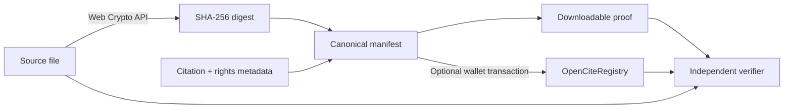

<div align="center">

# OpenCite

**Tamper-evident, rights-aware citations for humans and AI.**

[](https://github.com/sharziki/opencite/actions/workflows/ci.yml)
[](LICENSE)
[](#why-blockchain)
[](#privacy-and-rights)

[Quick start](#quick-start) · [How it works](#how-it-works) · [Trust model](#trust-model) · [Contributing](CONTRIBUTING.md)

</div>


AI increasingly answers questions without exposing the exact evidence behind an answer. Web pages change, files disappear, and citations can silently point at different bytes tomorrow.

OpenCite creates a portable proof for a source file:

- SHA-256 digest computed entirely in the browser;
- deterministic, human-readable citation manifest;
- optional wallet-signed registration on a public EVM ledger;
- independent local verification with no OpenCite account or API;
- explicit rights basis and evidence without uploading source content.

> OpenCite proves integrity, provenance, and time. It does **not** prove that content is factually true, lawful, safe, complete, or unbiased.

## Demo

The app works offline without a contract. Blockchain registration appears when `VITE_REGISTRY_ADDRESS` points to a deployed `OpenCiteRegistry`.

```bash
git clone https://github.com/sharziki/opencite.git
cd opencite
npm install
npm run dev
```

Open <http://127.0.0.1:5173>.

## How it works



1. Contributor chooses a local source file and enters citation metadata.
2. Browser hashes source bytes; the file is never sent to OpenCite.
3. App creates a canonical manifest and hashes that manifest.
4. Contributor downloads the manifest or registers both digests on-chain.
5. Any verifier recomputes the digest and checks the public record.

## Quick start

### Web application

```bash
npm install
npm run dev
```

### Full verification

```bash
npm run typecheck
npm test
npm run build:web
```

### Docker

```bash
docker compose up --build
```

Open <http://127.0.0.1:4173>. Container exposes `/healthz` for readiness checks.

## Smart contract

`OpenCiteRegistry.sol` stores:

| Field | Purpose |
| --- | --- |
| `contentHash` | Fingerprint of exact source bytes |
| `manifestHash` | Fingerprint of citation and rights metadata |
| `sourceURI` | Canonical public location supplied by attester |
| `license` | Declared rights basis—not a legal determination |
| `attester` | Wallet that signed registration transaction |
| timestamps | Registration and optional revocation state |

Source bytes are never stored on-chain. Records cannot be edited. Original attester may mark a record revoked; its history remains visible.

Run a local chain and deploy:

```bash
# terminal 1
npm run contract:node

# terminal 2
npm run contract:deploy:local
```

Copy deployed address into `.env`:

```dotenv
VITE_REGISTRY_ADDRESS=0x...
VITE_CHAIN_ID=31337
```

For Sepolia, copy `.env.example`, export `RPC_URL` and `DEPLOYER_PRIVATE_KEY`, then run `npm run contract:deploy:sepolia`. Use a dedicated test wallet only.

## Why blockchain?

Blockchain has one narrow job here: make attestations difficult for a single operator to alter or remove after publication. It does not store documents and does not decide truth.

OpenCite deliberately has:

- no token;
- no paid verification;
- no DAO or popularity vote over truth;
- no proprietary index required for local verification.

The architecture follows lessons from [Sigstore Rekor](https://github.com/sigstore/rekor) for append-only provenance, [Ethereum Attestation Service](https://github.com/ethereum-attestation-service/eas-contracts) for general attestations, [OpenTimestamps](https://github.com/opentimestamps/opentimestamps-client) for independently verifiable time proofs, and [C2PA](https://github.com/contentauth/c2pa-rs) for content provenance. OpenCite stays smaller: one manifest, one registry, one verifier.

## Trust model

### What verification establishes

- selected file matches the manifest's SHA-256 digest;
- manifest metadata has not changed after ledger registration;
- a specific wallet made the attestation at a recorded block time;
- attestation has or has not been revoked.

### What verification cannot establish

- source statements are true;
- wallet corresponds to claimed real-world identity;
- contributor owned required rights;
- source URL will remain available;
- blockchain timestamp equals original publication date.

Trust comes from evidence and accountable attesters—not hash length.

## Privacy and rights

OpenCite's browser verifier reads local files only to compute their digest. There is no upload endpoint or analytics service. On-chain registration publishes source URL, license declaration, wallet address, and both hashes permanently.

Do not register private URLs, personal information, access tokens, pirated download locations, or metadata you cannot lawfully publish. A hash-only citation does not authorize copying or distributing the underlying work. See [SECURITY.md](SECURITY.md).

This project is technical infrastructure, not legal advice.

## Manifest format

Manifests follow [`schema/source-manifest-v1.schema.json`](schema/source-manifest-v1.schema.json). Canonical serialization sorts object keys recursively and uses compact JSON before calculating `manifestHash`.

```json
{
  "citation": {
    "creator": "Example Institute",
    "sourceUrl": "https://example.org/report.pdf",
    "title": "Example report"
  },
  "content": {
    "byteLength": 12842,
    "filename": "report.pdf",
    "mediaType": "application/pdf",
    "sha256": "0x…"
  },
  "provenance": {
    "claim": "This record attests to source integrity and provenance. It does not establish factual truth.",
    "createdAt": "2026-09-10T12:00:00.000Z",
    "generator": "OpenCite/0.1.0"
  },
  "rights": {
    "basis": "CC-BY-4.0",
    "evidence": "https://example.org/license"
  },
  "schema": "https://github.com/sharziki/opencite/blob/main/schema/source-manifest-v1.schema.json",
  "version": 1
}
```

## Project status

OpenCite is an alpha reference implementation. Current scope covers local hashing, deterministic manifests, file verification, registry deployment, wallet registration, lookup, and revocation.

Before production use, complete an independent contract audit, establish a stable deployment and domain, add decentralized source availability, and define institution-level identity attestations.

## Contributing

Read [CONTRIBUTING.md](CONTRIBUTING.md). Useful first contributions:

- test manifest generation in more browsers;
- improve accessibility and translation;
- create adapters for AI citation formats;
- add optional OpenTimestamps proofs;
- design library and publisher identity attestations.

## License

[MIT](LICENSE) © 2026 OpenCite contributors.
