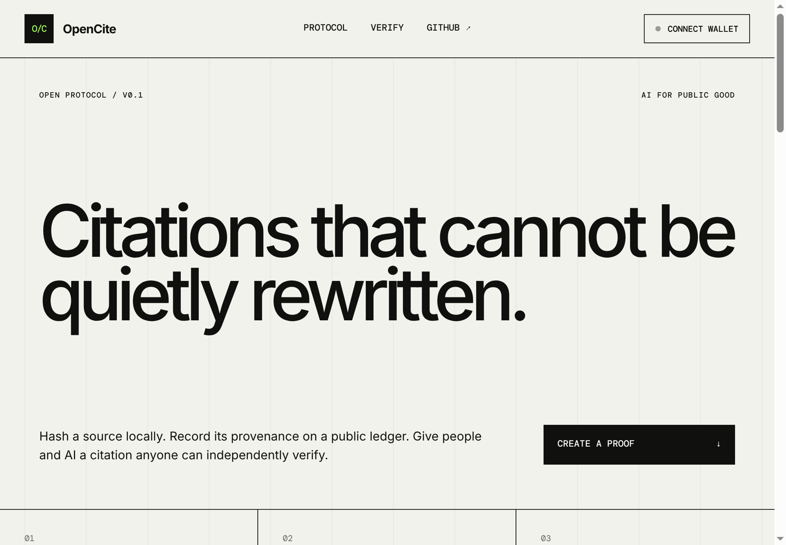
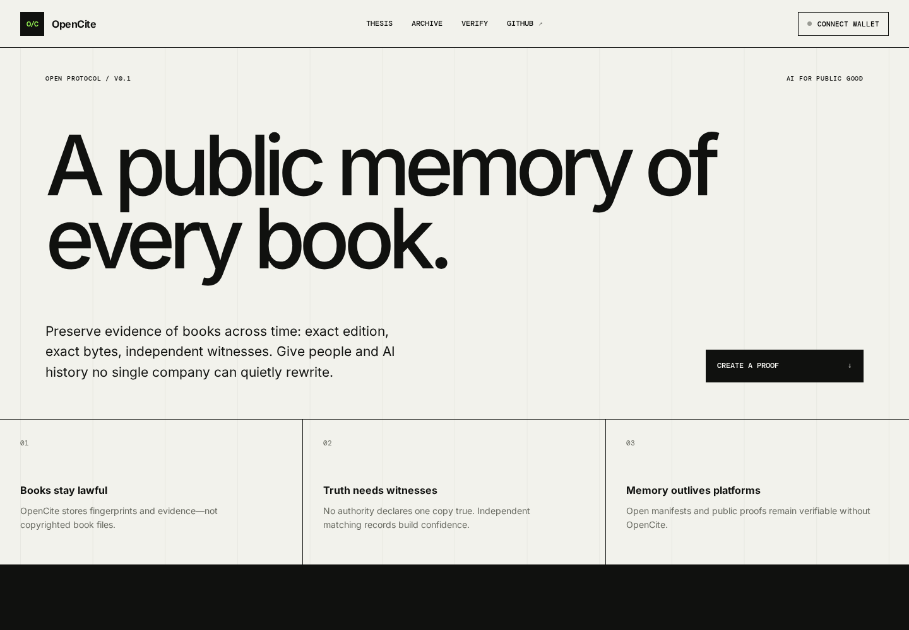
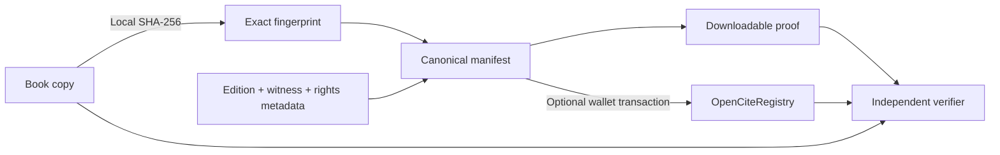

<div align="center">

# OpenCite

**A public memory of every book—for humans and AI.**

[](https://github.com/sharziki/opencite/actions/workflows/ci.yml)
[](LICENSE)
[](#why-blockchain)
[](#privacy-and-rights)

[Thesis](#the-thesis) · [Pilot archive](#pilot-archive) · [Quick start](#quick-start) · [Trust model](#trust-model) · [Contributing](CONTRIBUTING.md)

</div>



## The thesis

AI may become the main way people encounter history. Its source record must not belong to one model provider, government, publisher, or archive.

OpenCite is open infrastructure for a shared historical memory of books. It records exact editions, byte-level fingerprints, independent witnesses, rights declarations, and append-only attestations. Anyone can contribute evidence. Anyone can verify it. No operator gets to silently replace the past.

Historical confidence comes from **converging independent evidence**, not a blockchain vote. A library, publisher, researcher, and reader can each witness the same edition. Agreement strengthens provenance; disagreement remains visible for study instead of being erased.

> OpenCite preserves evidence about what existed. It does **not** declare a book's claims factually true, choose an authoritative edition, or grant copyright permission.

Read the full [OpenCite thesis](THESIS.md).

## What OpenCite records

Each portable witness manifest can describe:

- book title, creator, publication date, edition, and bibliographic identifier;
- exact SHA-256 fingerprint of a lawfully held or inspected copy;
- witness type and public evidence, such as a library catalog record;
- source location and declared rights basis;
- optional wallet-signed registration on a public EVM ledger.

Book bytes are hashed locally and never uploaded to OpenCite. Public-domain archives may mirror works separately; copyrighted copies remain with lawful custodians.

## Why this matters for AI

An AI system can cite an OpenCite manifest to identify the exact edition behind an answer. A verifier can then detect changed bytes, changed metadata, revoked attestations, and conflicts between witnesses without trusting OpenCite's website or database.

This creates a missing layer between preservation and AI: **portable, machine-readable evidence about sources**.

## Pilot archive

The repository ships a searchable pilot of 25 Project Gutenberg editions. During ingestion, OpenCite reads Project Gutenberg's OPDS metadata, accepts only records explicitly marked `Public domain in the USA`, downloads one EPUB edition temporarily, hashes its exact bytes, and writes a manifest plus discovery index. EPUB bytes are discarded and never committed.

Pilot manifests are reproducible but currently unsigned and not registered on a public chain. They prove the ingestion and discovery workflow; independent institutional witnesses remain the next milestone.



Every archive card can:

- open the lawful source landing page;
- download the portable witness manifest;
- copy an AI-ready citation containing exact content and manifest hashes.

Rebuild the collection:

```bash
npm run archive:build-pilot
```

Rights determinations are territorial. Project Gutenberg states that its copyright analysis follows United States law and users elsewhere must check local law. See its [permission guidance](https://www.gutenberg.org/policy/permission) and [terms of use](https://www.gutenberg.org/policy/terms_of_use.html).

## Demo

The app creates and verifies manifests offline. Blockchain registration appears when `VITE_REGISTRY_ADDRESS` points to a deployed `OpenCiteRegistry`.

```bash
git clone https://github.com/sharziki/opencite.git
cd opencite
npm install
npm run dev
```

Open <http://127.0.0.1:5173>.

## How it works



1. Contributor lawfully holds or inspects a book copy and identifies its edition.
2. Browser or CLI hashes its bytes locally; the file is never sent to OpenCite.
3. App creates a canonical manifest and hashes that manifest.
4. Contributor publishes the manifest and may register both digests on-chain.
5. Other witnesses repeat the process; independent agreement or conflict remains inspectable.

## Quick start

### Web application

```bash
npm install
npm run dev
```

### Command line

No account, server, or third-party CLI dependency:

```bash
npm run opencite -- create ./book.epub \
  --title "Moby-Dick" \
  --creator "Herman Melville" \
  --publication-date "1851" \
  --edition "First edition" \
  --identifier "OCLC 123" \
  --source-url "https://archive.example/moby-dick" \
  --rights "PUBLIC-DOMAIN"

npm run opencite -- verify ./book.epub ./book.epub.opencite.json
```

### Full verification

```bash
npm run typecheck
npm test
npm run build:web
```

### Docker

```bash
docker compose up --build
```

Open <http://127.0.0.1:4173>. Container exposes `/healthz` for readiness checks.

## Smart contract

`OpenCiteRegistry.sol` stores a minimal immutable anchor:

| Field | Purpose |
| --- | --- |
| `contentHash` | Fingerprint of exact source bytes |
| `manifestHash` | Fingerprint of citation and rights metadata |
| `sourceURI` | Canonical public location supplied by attester |
| `license` | Declared rights basis—not a legal determination |
| `attester` | Wallet that signed registration transaction |
| timestamps | Registration and optional revocation state |

Source bytes are never stored on-chain. Records cannot be edited. Original attester may mark a record revoked; its history remains visible.

Run a local chain and deploy:

```bash
# terminal 1
npm run contract:node

# terminal 2
npm run contract:deploy:local
```

Copy deployed address into `.env`:

```dotenv
VITE_REGISTRY_ADDRESS=0x...
VITE_CHAIN_ID=31337
```

For Sepolia, copy `.env.example`, export `RPC_URL` and `DEPLOYER_PRIVATE_KEY`, then run `npm run contract:deploy:sepolia`. Use a dedicated test wallet only.

## Why blockchain?

Blockchain has one narrow job: prevent one operator from quietly altering or deleting attestation history. It does not store books and does not decide truth.

OpenCite deliberately has:

- no token;
- no paid verification;
- no DAO, AI model, or popularity vote over truth;
- no proprietary index required for local verification.

The architecture follows lessons from [Sigstore Rekor](https://github.com/sigstore/rekor) for append-only provenance, [Ethereum Attestation Service](https://github.com/ethereum-attestation-service/eas-contracts) for general attestations, [OpenTimestamps](https://github.com/opentimestamps/opentimestamps-client) for independently verifiable time proofs, and [C2PA](https://github.com/contentauth/c2pa-rs) for content provenance. OpenCite stays smaller: one manifest, one registry, one verifier.

## Trust model

### What verification establishes

- selected file matches the manifest's SHA-256 digest;
- manifest metadata has not changed after ledger registration;
- a specific wallet made the attestation at a recorded block time;
- attestation has or has not been revoked.

### What verification cannot establish

- source statements are true;
- wallet corresponds to claimed real-world identity;
- contributor owned required rights;
- source URL will remain available;
- blockchain timestamp equals original publication date.

Trust comes from inspectable evidence, independent witnesses, and accountable attesters—not hash length. Multiple attestations can agree on one fingerprint or preserve conflicts between editions and witnesses.

## Privacy and rights

OpenCite's browser verifier and CLI read local files only to compute their digest. There is no upload endpoint or analytics service. On-chain registration publishes source URL, license declaration, wallet address, and both hashes permanently.

Do not register private URLs, personal information, access tokens, pirated download locations, or metadata you cannot lawfully publish. A hash-only citation does not authorize copying or distributing the underlying work. See [SECURITY.md](SECURITY.md).

This project is technical infrastructure, not legal advice.

## Manifest format

Manifests follow [`schema/source-manifest-v1.schema.json`](schema/source-manifest-v1.schema.json). Canonical serialization sorts object keys recursively and uses compact JSON before calculating `manifestHash`.

```json
{
  "citation": {
    "creator": "Herman Melville",
    "sourceUrl": "https://archive.example/moby-dick",
    "title": "Moby-Dick"
  },
  "bibliography": {
    "edition": "First edition",
    "identifier": "OCLC 123",
    "publicationDate": "1851"
  },
  "content": {
    "byteLength": 12842,
    "filename": "moby-dick.epub",
    "mediaType": "application/epub+zip",
    "sha256": "0x…"
  },
  "provenance": {
    "claim": "This record preserves evidence of a witnessed source. It does not establish factual truth.",
    "createdAt": "2026-09-10T12:00:00.000Z",
    "generator": "OpenCite/0.1.0"
  },
  "rights": {
    "basis": "PUBLIC-DOMAIN",
    "evidence": null
  },
  "schema": "https://github.com/sharziki/opencite/blob/main/schema/source-manifest-v1.schema.json",
  "version": 1,
  "witness": {
    "evidence": "https://library.example/catalog/123",
    "kind": "PHYSICAL-COPY"
  }
}
```

## Project status

OpenCite is an alpha reference implementation. Current scope covers book and edition metadata, witness evidence, browser and CLI hashing, deterministic manifests, local verification, registry deployment, wallet registration, lookup, and revocation.

The first lawful pilot contains 25 witnessed Project Gutenberg editions and AI-ready citation exports. Next proof of usefulness: obtain an independent second witness from a library or open-access archive. Before production use, complete an independent contract audit, establish a stable deployment and domain, add institution-level identity attestations, and design discovery across independent registries.

## Contributing

Read [CONTRIBUTING.md](CONTRIBUTING.md). Useful first contributions:

- test manifest generation in more browsers;
- improve accessibility and translation;
- create adapters for AI retrieval and citation formats;
- add optional OpenTimestamps proofs;
- contribute public-domain edition manifests and library catalog witnesses.

## License

[MIT](LICENSE) © 2026 OpenCite contributors.
